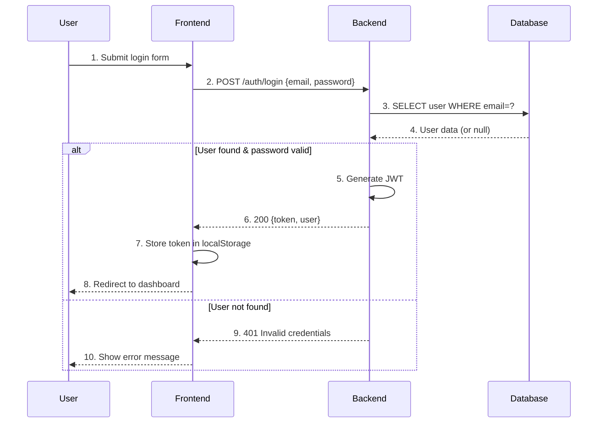
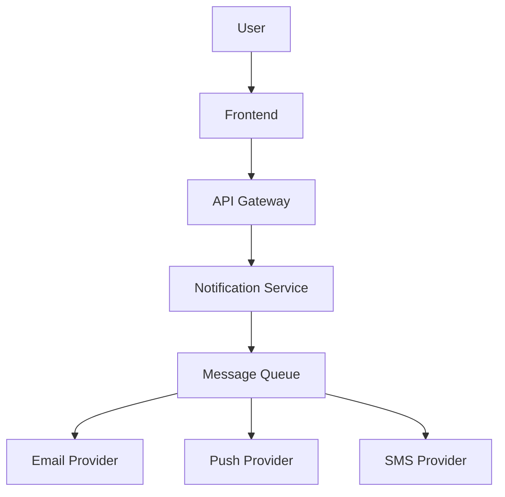

<!-- _class: title -->
# Session 01: Tech Spec with AI

**Duration:** 90 minutes  
**Objective:** Generate, maintain, and validate technical specifications using AI assistance.

---

## 1. Tech Spec Structure

A solid tech spec covers 8 key sections. AI helps generate drafts and fill details iteratively.

### Standard Tech Spec Template

```markdown
## Context
Mengapa proyek ini diperlukan? Problem apa yang mau diselesaikan?
Apa hubungannya dengan sistem existing?

## Goals
- Measurable outcomes
- What success looks like
- Technical and business goals

## Non-Goals
- What we're NOT doing (explicitly)
- Scope boundaries
- Future considerations

## Architecture
- High-level diagram (Mermaid)
- Component overview
- Data flow
- Key design decisions

## API Design
- Endpoints
- Request/response schemas
- Error handling
- Authentication/authorization

## Data Model
- Entities and relationships
- Schema definitions
- Migration strategy

## Migration Plan
- Steps from current to target state
- Rollback strategy
- Data integrity checks

## Risks & Mitigations
- Known unknowns
- Failure scenarios
- Contingency plans
```

### AI-Assisted Generation Flow

```
PRD Document
    │
    ▼
AI Generate → Tech Spec Draft (semua section)
    │
    ▼
Human Review → Edit/Refine per section
    │
    ▼
AI Iterate → Fill details, expand, add examples
    │
    ▼
AI Review → Check completeness, consistency, feasibility
    │
    ▼
Final Tech Spec
```

### Prompt: Generate Tech Spec from PRD

```
Kamu adalah principal engineer. Dari PRD berikut, generate tech spec
lengkap dengan 8 section (Context, Goals, Non-Goals, Architecture,
API Design, Data Model, Migration Plan, Risks & Mitigations).

PRD:
[tempel PRD]

Format:
- Tiap section minimal 3 poin
- Architecture section include Mermaid diagram
- API section include example request/response
- Data model section include table definitions
```

---

## 2. Architecture Decision Records (ADR)

ADR mencatat keputusan arsitektur penting beserta konteks dan alternatifnya.

### ADR Template

```markdown

---

# ADR-[N]: [Title]

## Status
Proposed | Accepted | Deprecated | Superseded

## Context
Problem yang dihadapi, constraints, faktor yang mempengaruhi.

## Decision
Keputusan yang diambil dan rationale detail.

## Options Considered
| Option | Pros | Cons |
|--------|------|------|
| A      | ...  | ...  |
| B      | ...  | ...  |

## Consequences
Apa konsekuensi dari keputusan ini? Trade-offs?

## References
Link ke docs, RFC, PR terkait.
```

### AI Generate ADR Prompt

```
Dari keputusan arsitektur berikut, generate ADR dengan format
lengkap (Context, Decision, Options Considered, Consequences):

Keputusan: [deskripsi keputusan]

Options yang dipertimbangkan:
1. [option A] — [pros/cons]
2. [option B] — [pros/cons]
3. [option C] — [pros/cons]

Bikin table comparison untuk options. Include rationale
kenapa option terpilih.
```

---

## 3. Sequence Diagram with Mermaid + AI

AI bisa generate Mermaid sequence diagram dari deskripsi teks.

### Prompt: Text → Mermaid Diagram

```
Dari deskripsi flow berikut, generate Mermaid sequence diagram:

User login → Frontend kirim POST /auth/login → Backend validasi
→ Database check user → Generate JWT → Return token ke frontend
→ Frontend simpan di localStorage

Detail:
- Participant: User, Frontend, Backend, Database
- Include alt/else untuk error case
- Label tiap step dengan nomor
```

### Example Output



### Mermaid Types for Tech Spec

| Type | Use Case |
|------|----------|
| `sequenceDiagram` | API interaction flow |
| `flowchart TD` | System architecture |
| `classDiagram` | Data model / Entities |
| `stateDiagram-v2` | State machine / Workflow |
| `C4Context` | C4 model context diagram |
| `erDiagram` | Entity-Relationship |
| `gitGraph` | Git workflow / branching |

---

## 4. Lint Spec with AI

AI review tech spec for completeness, consistency, and feasibility.

### AI Spec Review Checklist

| Check | Description |
|-------|-------------|
| Completeness | Semua 8 section ada? Ada yang missing? |
| Consistency | Istilah konsisten? API di spec match data model? |
| Feasibility | Estimasi realistic? Dependencies clear? |
| Clarity | Bagian yang ambiguous? Perlu detail tambahan? |
| Risk Coverage | Risks teridentifikasi? Ada mitigasi? |

### Prompt: AI Review Tech Spec

```
Review tech spec berikut sebagai senior engineer:

[tempel tech spec]

Check:
1. Completeness: Ada section yang kurang?
2. Consistency: Ada kontradiksi internal?
3. Feasibility: Ada yang technically impossible?
4. Clarity: Bagian mana yang perlu detail tambahan?
5. Risk: Ada risk yang missed?

Output format:
- [Issue Type] Section: Deskripsi
- [Suggestion] Perbaikan yang disarankan
```

---

## 5. Latihan: Generate Tech Spec from PRD

### Scenario
Kamu dikasih PRD untuk fitur "User Notification Preferences" — user bisa pilih channel notifikasi (email, push, SMS) dan atur preferensi per kategori.

### Steps

1. **Generate Draft**: Tempel PRD di AI prompt → dapat draft tech spec
2. **Review & Edit**: Baca draft, perbaiki bagian yang kurang tepat
3. **Add ADR**: Buat ADR untuk 1 keputusan arsitektur (misal: pilih message queue atau langsung call)
4. **Add Diagram**: Generate Mermaid sequence diagram untuk flow user update preferences
5. **AI Review**: Minta AI review tech spec, iterasi perbaikan

### Deliverable

File `lab/notification-spec.md` yang berisi:

- Tech spec lengkap 8 sections
- Minimal 1 ADR
- Minimal 1 Mermaid diagram (sequence/flowchart)
- Hasil review AI dan perbaikan yang dilakukan

### Template Starter

```markdown

---

# Tech Spec: User Notification Preferences

## Context
[Generated by AI]

## Goals
[Generated by AI]

## Non-Goals
[Generated by AI]

## Architecture

```

---

## Key Takeaways

- Tech spec punya 8 section standard yang bisa digenerate AI dari PRD
- ADR dokumentasi keputusan arsitektur dengan context + options + rationale
- Mermaid diagram bisa digenerate AI dari deskripsi teks
- AI bisa review spec untuk completeness, consistency, feasibility
- Iterasi AI → Human → AI hasilkan spec yang lebih baik
